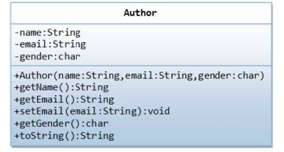
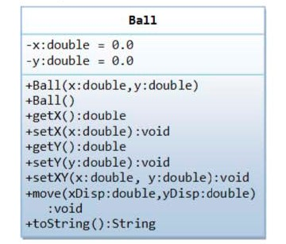

# Практическая работа 4. UML
Практическая работа №4 дисциплине «[Программирование на языке Джава](https://online-edu.mirea.ru/course/view.php?id=4053)» (РТУ МИРЭА, ИИТ, 2-ой курс).

**Преподаватель**: Ермаков Сергей Романович, ermakov_s@mirea.ru, ermakov@sumirea.ru.

***Ref**: методические указания по выполнению **практических** работ (№2)*

## Задание на практическую работу

1. По UML-диаграмме класса, описывающей сущность Автор, необходимо написать программу, которая состоит из двух классов Author и TestAuthor. 
   Author должен содержать реализацию методов, представленных на диаграмме класса.
   
   
   
2. По UML-диаграмме класса, представленной на рисунке, нужно написать программу, которая состоит из двух классов. Ball должен реализовывать сущность мяч, а TestBall тестировать работу созданного класса. Ball должен содержать реализацию методов, представленных на UML-диаграмме.
   
   

## Дополнительные материалы

[Java Классы и Объекты - написание собственных классов, конструкторы (javarush.ru)](https://javarush.ru/groups/posts/1949-znakomstvo-s-klassami-napisanie-sobstvennihkh-klassov-konstruktorih)

[UML что это? От теории к практике (javarush.ru)](https://javarush.ru/groups/posts/uml-v-java)
