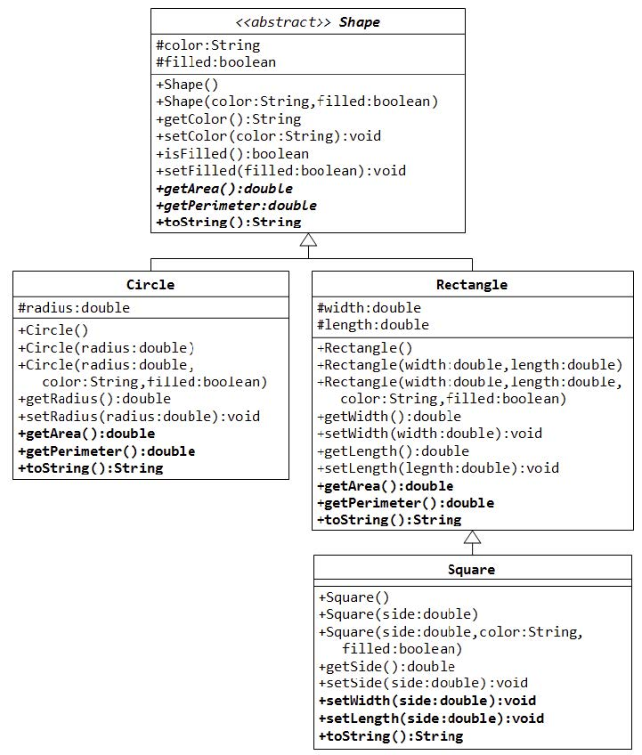
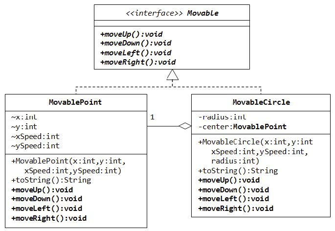
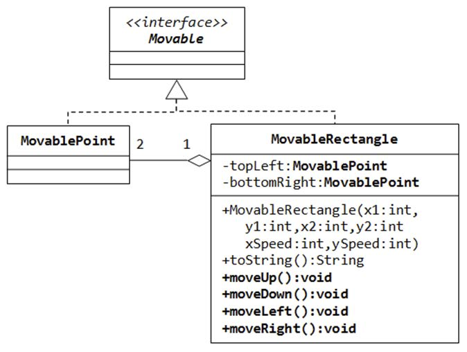

# Практическая работа 7. Абстрактный суперкласс, подклассы
Практическая работа №7 дисциплине «[Программирование на языке Джава](https://online-edu.mirea.ru/course/view.php?id=4053)» (РТУ МИРЭА, ИИТ, 2-ой курс).

**Преподаватель**: Ермаков Сергей Романович, ermakov_s@mirea.ru, ermakov@sumirea.ru.

***Ref**: методические указания по выполнению **практических** работ (№3)*

## Задание на практическую работу

1. Прочитайте UML-диаграмму Shape.jpg: на диаграмме представлены абстрактный суперкласс Shape и его подклассы Circle, Rectangle and Square.

2. Создайте абстрактный родительский суперкласс Shape и его дочерние классы (подклассы).
   
3. Перепишите суперкласс Shape и его подклассы так, как это представлено на UML-диаграмме Circle, Rectangle and Square.

   > В этом задании класс Shape определяется как абстрактный класс:
   > • Два поля или переменные класса объявлены с модификатором protected color (тип String) и filled (тип boolean). Такие защищенные переменные могут быть доступны в подклассах и классах в одном пакете. Они обозначаются со знаком “#” на диаграмме классов в нотации языка UML.
   > • Геттеры и сеттеры для всех переменных экземпляра класса, метод toString().
   > • Два абстрактных метода getArea() и getPerimeter() выделены курсивом в диаграмме класса. В подклассах Circle (круг) и Rectangle (прямоугольник) должны переопределяться абстрактные методы getArea() и getPerimeter(), чтобы обеспечить их надлежащее выполнение для конкретных экземпляров типа подкласс. Также необходимо для каждого подкласса переопределить toString() .
   
   
   
4. Вам нужно написать тестовый класс, чтобы самостоятельно проверить код ниже. Необходимо объяснить полученные результаты и связать их с понятием ООП - полиморфизм. Некоторые объявления могут вызвать ошибки компиляции. Объясните полученные ошибки, если таковые имеются.
   
   ```java
   Shape s1 = new Circle(5.5, "RED", false); // Upcast Circle to Shape
   System.out.println(s1); // which version?
   System.out.println(s1.getArea()); // which version?
   System.out.println(s1.getPerimeter()); // which version?
   System.out.println(s1.getColor());
   System.out.println(s1.isFilled());
   System.out.println(s1.getRadius());
   Circle c1 = (Circle)s1; // Downcast back to Circle
   System.out.println(c1);
   System.out.println(c1.getArea());
   System.out.println(c1.getPerimeter());
   System.out.println(c1.getColor());
   System.out.println(c1.isFilled());
   System.out.println(c1.getRadius());
   Shape s2 = new Shape();
   Shape s3 = new Rectangle(1.0, 2.0, "RED", false); // Upcast
   System.out.println(s3);
   System.out.println(s3.getArea());
   System.out.println(s3.getPerimeter());
   System.out.println(s3.getColor());
   System.out.println(s3.getLength());
   Rectangle r1 = (Rectangle)s3; // downcast
   System.out.println(r1);
   System.out.println(r1.getArea());
   System.out.println(r1.getColor());
   System.out.println(r1.getLength());
   Shape s4 = new Square(6.6); // Upcast
   System.out.println(s4);
   System.out.println(s4.getArea());
   System.out.println(s4.getColor());
   System.out.println(s4.getSide());
   // Take note that we downcast Shape s4 to Rectangle,
   // which is a superclass of Square, instead of Square
   Rectangle r2 = (Rectangle)s4;
   System.out.println(r2);
   System.out.println(r2.getArea());
   System.out.println(r2.getColor());
   System.out.println(r2.getSide());
   System.out.println(r2.getLength());
   // Downcast Rectangle r2 to Square
   Square sq1 = (Square)r2;
   System.out.println(sq1);
   System.out.println(sq1.getArea());
   System.out.println(sq1.getColor());
   System.out.println(sq1.getSide());
   System.out.println(sq1.getLength());
   ```
   
5. Напишите два класса MovablePoint и MovableCircle - которые реализуют интерфейс Movable.
   
   
   
   ```java
   public interface Movable {
   // saved as "Movable.java"
   public void moveUp();
   ......
   }
   ```
   
6. Напишите новый класс MovableRectangle (движущийся прямоугольник). Его можно представить, как две движущиеся точки MovablePoints (верхняя левая и нижняя правая точки) и реализующие интерфейс Movable. Убедитесь, что две точки имеет одну и ту же скорость.
   
   

## Дополнительные материалы

[Абстрактные классы в Java c примерами (javarush.ru)](https://javarush.ru/groups/posts/1973-abstraktnihe-klassih-v-java-na-konkretnihkh-primerakh)

[Наследование в Java, композиция и агрегирование, отношения между классами (javarush.ru)](https://javarush.ru/groups/posts/1967-otnoshenija-mezhdu-klassami-nasledovanie-kompozicija-i-agregirovanie-)

